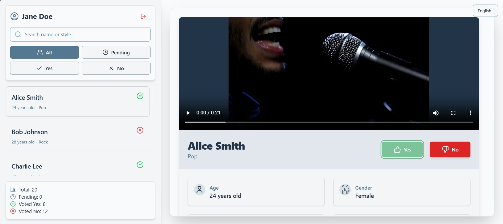

# 🎵 Rhythm of Talent Jury

A sleek and responsive **jury voting platform** designed for talent competitions. This platform allows jurors to view candidate profiles, watch performance videos, and cast their votes — all within a modern and intuitive interface.

## 🚀 Live Demo

🔗 [View the Live Project](https://rhythm-of-talent.vercel.app/)

## 📌 Features

- 🎭 View detailed profiles of performers
- 📹 Watch performance videos seamlessly
- ✅ Cast and update votes with ease
- 💡 Clean, modern UI for smooth user experience

## 🛠 Tech Stack

- **Frontend Framework:** [React](https://reactjs.org/)
- **Build Tool:** [Vite](https://vitejs.dev/)
- **Styling:** [Tailwind CSS](https://tailwindcss.com/)
- **Animations:** [Framer Motion](https://www.framer.com/motion/)
- **Routing:** [React Router](https://reactrouter.com/)
- **HTTP Requests:** [Axios](https://axios-http.com/)
